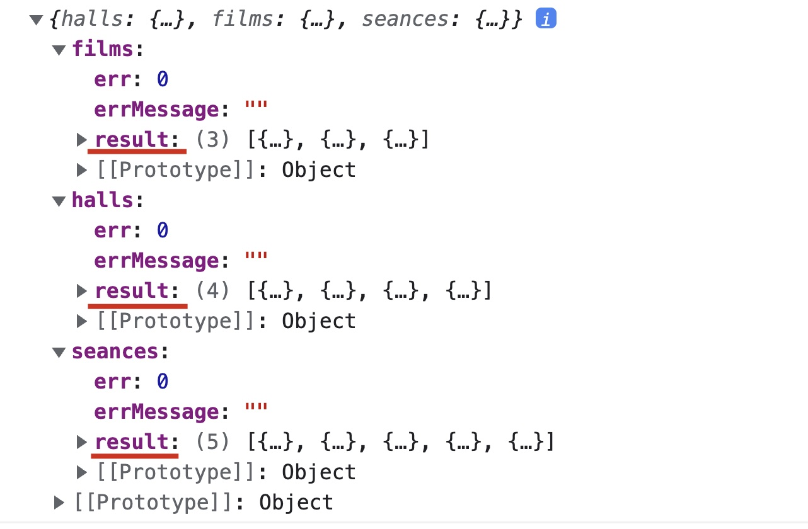
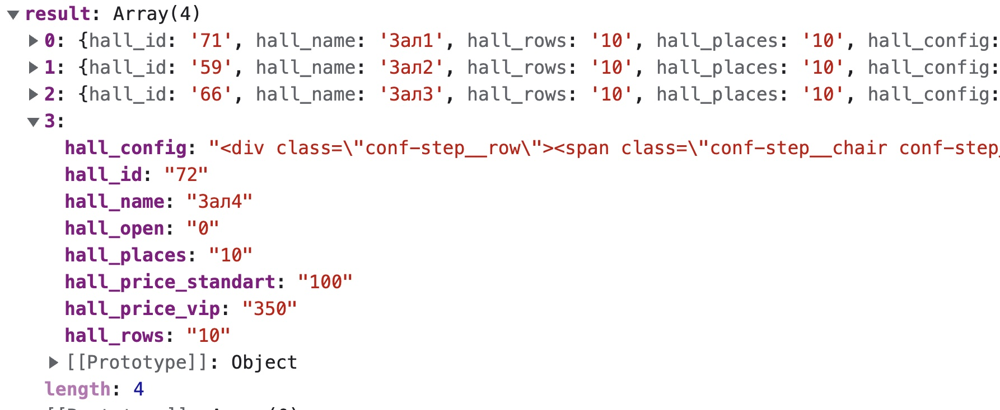
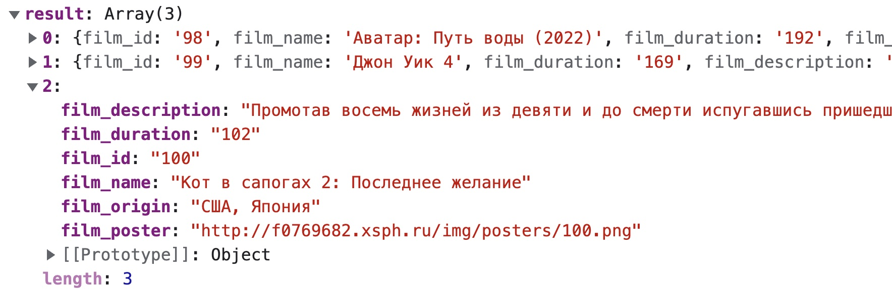
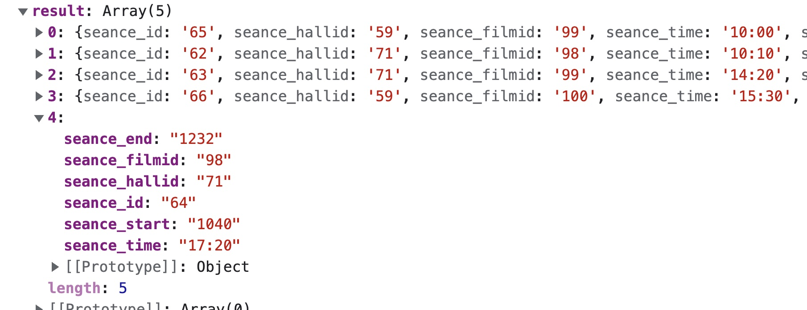

# Получение списков всех Залов Кинофильмов и Сеансов

Получение списка всех залов фильмов и сеансов которые хранятся на сервере

## Параметры
В качестве тела POST запроса передайте строку `event=update`

## Результат

Объект с тремя полями
* `halls {...}` - содержит список всез Залов (массив с объектами)
* `films {...}` - содержит список всех Фильмов (массив с объектами)
* `seances {...}` - содержит список всех Сеансов (массив с объектами)
Чтобы обратиться к массиву с данными необходимо использовать  **ключ** `result` (Например `halls.result`)

### halls
Хранит в себе массив объектов со следующими свойствами
* `hall_id` - ID зала 
* `hall_name` - Название зала
* `hall_open` - Принимает значение 1  если зал открыт для посетителей и значение 0 если зал закрыт для посетителей
Залы со значением `hall_open = 0` не должны отображаться на странице
* `hall_price_standart` - Цена стандартного билета
* `hall_price_vip` - Цена ВИП билета
* `hall_places` - Количество мест в ряду (данное значение вам может не потребоваться)
* `hall_row` - Количество рядов в зале  (данное значение вам может не потребоваться)
* `hall_config` - Конфигурация посадочных мест в пустом зале.
Представляет собой текст - ***html разметку*** которую следует поместить на странице `hall.html` внутри контейнера с классом `conf-step__wrapper`(см разметку)

### films
Хранит в себе массив объектов со следующими свойствами
* `film_id` - ID фильма 
* `film_name` - Название фильма
* `film_duration` - Длительность фильма в минутах
* `film_origin` - Страна 
* `film_poster` - Ссылка на картинку-постер с фильмом
*  `film_description` - Текстовое описание фильма

### seances
Хранит в себе массив объектов со следующими свойствами
* `seance_id` - ID сеанса 
* `seance_filmid` - ID фильма который показывают на этом сеансе
* `seance_hallid` - ID зала в котором показывают на этом сеансе
* `seance_time` - Время начала сеанса в строковом формате. Например **10:00**
* `seance_start` - Время начала сеанса в числовом формате - в минутах. Например если сеанс начинается в **11:20** то значение `seance_start` = 11 * 60 + 20 = **680** 
*  `seance_end` - Время окончания сеанса в числовом формате - в минутах. Например если сеанс заканчивается в **11:20** то значение `seance_start` = 11 * 60 + 20 = **680**  (данное значение вам может не потребоваться)
